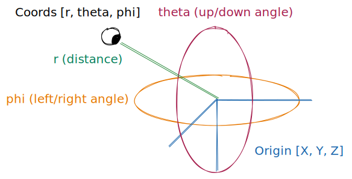

# 🕹️ control-kit

This is a toolkit for implementing react-three-fiber camera controls.

## Status: Alpha

This library is brand new and currently awaiting feedback.
Please DM me (neftaly) on the Poimandres discord with any comments, questions, or encouragement.

- Incomplete types
- No tests
- No gestures <./examples/EXAMPLE-WIP-multitouch-gestures.md>
- These functions will be renamed:
  - `normalizeCoords`
  - `getScreenXY`
- These functions will have their signature (args, arg order) changed:
  - `getScreenXY`
- `<PerspectiveCamera>` is positioned with `<group>` (some Drei components don't work correctly)
- Major API changes not expected

If you want to evaluate using this in production (for agencies, interactive exhibits, commercial products, etc), please get in touch.

## Rationale

Camera controls are generally the main way humans interact with 3D apps.
They must handle multiple input methods (touch, keyboard, mouse, gamepads, XR, pen, etc) but should get out of the way when not needed.

We have found "kitchen sink" camera controllers to be difficult to integrate into state management, and easy to outgrow.

Rather than ship an entire controller, we aim to provide composable pieces for building one, patterns for common requirements, and boilerplate to get started with.

## Example

To see the full importable <./examples/r3f-zustand> example, run `npm start`.

```js
import { Canvas, useThree } from '@react-three/fiber'
import { create } from 'zustand'
import {
  ControlRig,
  SphericalCamera,
  bitmaskToArray,
  normalizeCoords
} from 'control-kit'

const cameraConfig = {
  minR: 1,
  maxR: Infinity,
  minTheta: Math.PI / 16,
  maxTheta: Math.PI / 2
}

const useCamera = create(() => ({
  origin: [0, 0, 0],
  coords: [0, 0, 0]
}))

const eventHandler = ({ buttons, movementX, movementY }) => {
  const {
    origin,
    coords: [r, theta, phi]
  } = useCamera.getState()
  const [leftButton, rightButton] = bitmaskToArray(buttons)
  if (leftButton) {
    // Rotate camera
    const coords = normalizeCoords(cameraConfig, [
      r,
      theta + movementY / 100,
      phi - movementX / 100
    ])
    useCamera.setState({ origin, coords })
  }
}

const OrbitControls = () => {
  const target = useThree((three) => three.gl.domElement) // Canvas DOM element
  return (
    <>
      <SphericalCamera updateStream={useCamera.subscribe} />
      <ControlRig
        target={target}
        onEvent={eventHandler}
        eventTypes={['pointermove']}
      />
    </>
  )
}

export const App = () => (
  <Canvas>
    <OrbitControls />
  </Canvas>
)
```

## API: DOM

These functions are for input handling, independent of r3f.

### `ControlRig`

This convenience component attaches an `onEvent` event handler to a `target` element, for every event listed in `eventTypes`.
The `options` prop to is passed to the `addEventListener` call.

`event.preventDefault()` is called on all events in the `preventDefaults` prop.
See the note in <README.md#addPreventDefaults> for advice on which events to use.

```js
const App = () => {
  const target = useThree((three) => three.gl.domElement) // Get r3f canvas DOM element
  return (
    <Canvas>
      <ControlRig
        target={target}
        onEvent={(event) => console.log(event.type)}
        preventDefaults={['wheel', 'touchstart', 'contextmenu']}
        eventTypes={[
          'wheel',
          'pointerover',
          'pointerenter',
          'pointerdown',
          'pointermove',
          'pointerup',
          'pointercancel',
          'pointerout'
        ]}
      />
    </Canvas>
  )
}
```

### `bitmaskToArray`

This function converts `event.buttons` from a pointer event into an array of booleans.

```js
const onPointerMove = (event) => {
  const [
    leftMouseButton,
    rightMouseButton,
    middleMouseButton,
    mouseButton4,
    mouseButton5
  ] = bitmaskToArray(event.buttons)
}
```

### `addEventListeners`

Adds event listeners for list of events to a target; returns a function to remove them.
See <https://developer.mozilla.org/en-US/docs/Web/API/EventTarget/addEventListener>.

**Note:** You should avoid using mouse and touch events, as they have been obsoleted by pointer events.

**Note:** You should avoid using `contextmenu` events.
They are not supported on iOS.
Unless you have a specific need for `contextmenu`, you should use a right-click or long-press gesture instead.

```js
const removeEventListeners = addEventListeners(
  document.getElementById('mydiv'),
  [
    'wheel',
    'pointerover',
    'pointerenter',
    'pointerdown',
    'pointermove',
    'pointerup',
    'pointercancel',
    'pointerout'
  ],
  (event) => console.log(event.type),
  { capture: false, once: false, passive: false }
)
```

### `addPreventDefaults`

Adds `event.preventDefault()` to a list of events; returns a function to remove them.

```js
const removePreventDefaults = addPreventDefaults(
  document.getElementById('mydiv'),
  ['wheel', 'touchstart', 'contextmenu']
)
```

**Note:** You should preventDefault these events:

```js
const types = [
  // Block ctrl + mousewheel (zoom in/out on most browsers)
  // Block alt + mousewheel (history gesture in Firefox)
  'wheel',

  // Block iOS swipe history gesture <https://pqina.nl/blog/blocking-navigation-gestures-on-ios-13-4/>
  'touchstart',

  // Stop right-clicks from opening the browser context menu
  'contextmenu'
]
```

## API: Camera

These functions are specifically for handling 3D cameras.



```js
// origin: target world position
const [x, y, z] = origin

// coords: camera rotation, relative to origin
const [
  r, // Distance to origin
  theta, // Polar (up-down) angle
  phi // Azimuthal (left-right) angle
] = coords
```

### `SphericalCamera`

This component creates a `<PerspectiveCamera>` looking at `origin`, rotated by `coords`.
It accepts all PerspectiveCamera props (`makeDefault` is true by default).

For performance reasons you should use `updateStream` instead of the `origin` & `coords` props.

The `updateStream` prop is provided as an escape hatch to bypass React reconciliation with imperative `{origin?,coords?}` updates.
For further discussion see <./examples/EXAMPLE-React-props-useState.md>.

### `normalizeCoords`

**Note:** This function will be renamed in the future.

This function takes a `coords` array and:

- Constrains `r` (min/max distance to/from origin)
- Constrains `theta` (min/max up/down angle)
- Normalizes `phi` to 0 <> 2π rads (if we rotated 360°, reset to 0°)

```js
const [r, theta, phi] = normalizeCoords(
  {
    minR: 0,
    maxR: Infinity,
    minTheta: 0,
    maxTheta: Math.PI / 2
  },
  coords
)
```

### `getScreenXY`

**Note:** This function will be renamed in the future.

**Note:** The arguments and return values for this function will be changed in the future.

This function takes `movementX`, `movementY` from a PointerEvent and rotates them around `phi`.

## Notes

### Trackpad `wheel` events

Most laptop trackpads support multitouch gestures.

Firefox and Chrome handle them as `WheelEvent`s with `ctrlKey: true`.

- 2-finger swipes behave like 2D mousewheel events (`deltaX`, `deltaY`).
- 2-finger pinch (pinch-zooming) happens in the `deltaZ` direction.
- 2-finger rotation gestures are not supported.

[Diagram showing 2-finger swipe, pinch, and rotation multitouch gestures]

Safari has more advanced support via the proprietary `gesturestart`/`gesturechange`/`gestureend` events; unfortunately the author has no experience with these.

- A shim for Firefox/Chrome-style wheel event behavior in Safari should be found or made available.
- An example handler for Safari gesture events should be made available.

2-finger-swipes can travel in both X and Y directions simultaneously, however the gesture may have to be initiated with diagonal touchpad movement (depending on firmware), otherwise it may only move along one axis. Users should be made aware of this in onboarding.

It is recommended to show the "ctrl" key as a wheel modifier key in keyboard config interfaces, but to prevent it from being changed.

### `touchAction: 'none'`

> Make sure you always set [touchAction](https://developer.mozilla.org/en-US/docs/Web/CSS/touch-action) on a draggable element to prevent glitches with the browser native scrolling on touch devices

-- [pmndrs/use-gesture](https://github.com/pmndrs/use-gesture)

### In-app cursors

There is latency between the actual mouse cursor position and the position reported to the DOM.
This can be visualized here: <https://rsms.me/projects/pointer-latency/>

It is possible to mask this latency by hiding the system cursor and showing your own cursor (an emoji or SVG etc).

This is generally not recommended, as it makes a11y worse, the cursor may fail to load, and there is discontinuity for the user when entering/leaving the window. However, in certain contexts (fullscreen apps etc), showing an in-app cursor can help with pointing precision and game feedback.
